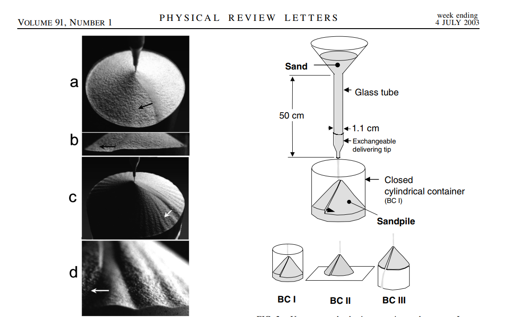

# Instability in Sandpiles

Hello my friend, welcome to the cemetery warehouse of a failed project.

For an introduction to the problem, see the two articles and the video in the RR folder

[Altshuler, Sandpile Formation by Revolving Rivers, PRL 2003](/Reference/RR/altshuler2003.pdf)

[Altshuler, Revolving rivers in sandpiles: From continuous to intermittent flows, PRE 2008](/Reference/RR/altshuler2008.pdf)

[Video of the sandpile phenomenon](/Reference/RR/Revolving_rivers.mp4)

In short, it describes the formation mechanism of sand piles and why the flow of sand piles deflects under certain conditions.

The analysis idea of this warehouse is to derive the sand flow stability on the cone from the flow stability.

Here are the instructions for each folder:

[README_code](/Code/README_code.md)

[README_math](/Math/README_math.md)

[README_theorem](/Theorem/README_theorem.md)

[README_ppt](/PPT_discussion/README_ppt.md)

[README_ref](/Reference/README_ref.md)

I strongly recommend you to read **README_ppt** and **README_ref** before you start to read every ***.pptx*** file. 